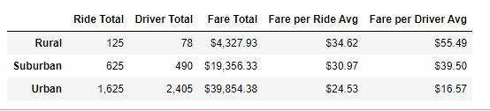
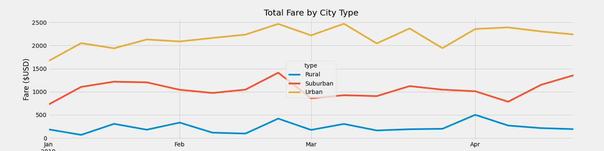

# PyBer Analysis
Module 5: PyBer with Matplotlib, Ridesharing data analysis Challenge

## Overview of Analysis
This analysis aims to use the data given in the CSV files regarding PyBer's ride-sharing data. 
We created a DataFrame of the data by different location types: Urban, Suburban, and Rural. We then made a line graph representing the total weekly fares for each location type. The goal was to find the differences in those location types and what can be learned from the data from the perspective of PyBer.

## Results

### DataFrame Analysis

As the above dataframe shows, city type correlates with many different metrics. As the city type gets more dense (rural being least dense, and urban being most dense), ride and driver totals go up, while average fare per ride go down, along with the fare per average driver. The increase in quantity outpaces the decrease in average fare, though, meaning that the fare totals for denser areas are higher than As the above data frame shows, city type correlates with many different metrics. As the city type gets denser (rural being least dense, and urban being most dense), ride and driver totals go up, while average fare per ride goes down, along with the fare per average driver.
 
This price difference can be understood by the long drives in rural areas and fewer drivers in rural areas versus urban, therefore driving up the price.for less dense areas. 

### Charting the Fares by City Type Over Time

The line chart above reveals more interesting trends. This visually represents the gap in total fares between different city types, with dense Urban cities bringing the most revenue, suburban centers second, and rural locations bringing in the least in fares. Over time, the three city types do seem to move together, but spikes and dips in different city types are not perfectly correlated. Still, similar spikes in fare total in the last week of February suggest there are global similarities in fare totals over time.

## Summary

As we have shown in the above summaries, rides are more expensive in rural and suburban areas, and there are fewer drivers. This may discourage or make less accessible the PyBer service in these areas. 

If we want to increase the availability of rides in these city types, we can look into the following strategies:

- Encourage more drivers to sign up and look for rides in suburban and rural areas only. As the number of available drivers increases, wait times, ride cost,s and other obstacles to accessing PyBer services goes down.

- Assess the motives all three locations had a spike in Total Fares towards the end of February. Perhaps the answer to that information could help us in the future.

- A related approach would be to change the algorithm that establishes ride cost in different regions. If we, say, charged less per mile in suburban and rural areas, the extra distance that is likely to occur between start and end points is less of a cost factor for customers looking for a ride. While fixed costs can remain similar, it will decrease the impact that lower density has on suburban and rural ride numbers and cost.

- One last recommendation for the company is reducing the number of drivers in urban areas. There are almost 800 more drivers than rides and is the only location with more drivers than rides. Reducing the number of drivers or relocating them to other areas could be an alternative to speed up PyBer expansion in rural and suburban areas. 
